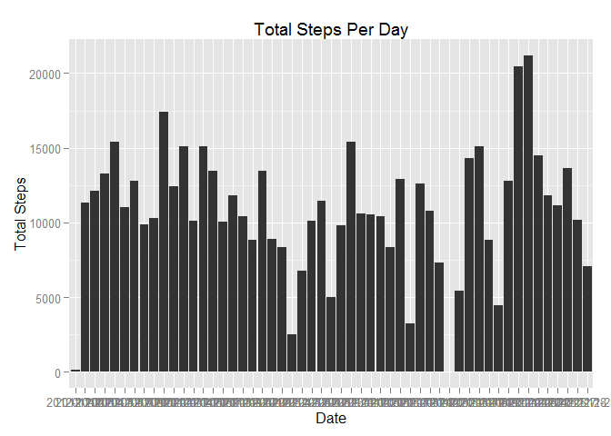

# Reproducible Research: Peer Assessment 1

## Global Settings

Show all code and results


```r
library(knitr)
opts_chunk$set(echo=TRUE, results="show")
options(scipen=1, digits=2)
```


## Loading and preprocessing the data

Check if "activity" folder exists; if not, download and unzip it


```r
if (!file.exists("activity.csv")) 
    {url <- "http://d396qusza40orc.cloudfront.net/repdata%2Fdata%2Factivity.zip"
    zipfile <- "activity.zip"
    download.file(url, zipfile)
    unzip(zipfile, overwrite=TRUE)}
```

Load and summarise data


```r
activity <- read.csv(file="activity.csv", header=TRUE)
summary(activity)
```

```
##      steps              date          interval   
##  Min.   :  0    2012-10-01:  288   Min.   :   0  
##  1st Qu.:  0    2012-10-02:  288   1st Qu.: 589  
##  Median :  0    2012-10-03:  288   Median :1178  
##  Mean   : 37    2012-10-04:  288   Mean   :1178  
##  3rd Qu.: 12    2012-10-05:  288   3rd Qu.:1766  
##  Max.   :806    2012-10-06:  288   Max.   :2355  
##  NA's   :2304   (Other)   :15840
```


## What is mean total number of steps taken per day?

Reshape data to calculate total number of steps per day and remove NA values


```r
library(plyr)
activityclean <- na.omit(activity) 
activity2<- ddply(activityclean, "date", summarise, total.steps=sum(steps))
```

Plot total number of steps per day


```r
library(ggplot2)
ggplot(data=activity2, aes(x=date, y=total.steps)) + 
      geom_histogram(stat="identity") + xlab("Date") + ylab("Total Steps") + 
      ggtitle("Total Steps Per Day")
```

 

Calculate mean and median steps per day


```r
meansteps <- mean(activity2$total.steps)
mediansteps <- median(activity2$total.steps)
```

**The mean total steps per day is 10766.19 and the median is 10765.**  


## What is the average daily activity pattern?

Reshape data to show average number of steps for each interval across all days
Plot average steps for each interval


```r
activity3 <- ddply(activityclean, "interval", summarise, mean.steps=mean(steps))
plot(activity3$interval, activity3$mean.steps, type="l", 
     main="Average Steps Per Interval", xlab="Interval", ylab="Average Steps")
```

 

Identify interval with the most number of steps on average across all days


```r
maxsteps <- max(activity3$mean.steps)
rowinterval <- which(activity3$mean.steps==maxsteps)
maxinterval <- activity3[rowinterval, 1]
```

**The interval with the most number of average steps is 835.**  


## Imputing missing values

Calculate and report the total number of missing values in the dataset


```r
missing <- length(which(is.na(activity)))
```

**There are 2304 missing values in the dataset.**

Replace missing values in dataset with mean number of steps for that interval


```r
activityfull <- activity
activityfull$steps <- with(activityfull,ifelse(
      is.na(steps),
      ave(steps,interval,FUN=function(x) mean(x,na.rm=TRUE)),
      steps
      ))
```

Plot total number of steps per day from new dataset


```r
activityfull2 <- ddply(activityfull, "date", summarise, total.steps=sum(steps))
ggplot(data=activityfull2, aes(x=date, y=total.steps)) + 
      geom_histogram(stat="identity") + xlab("Date") + ylab("Total Steps") + 
      ggtitle("Total Steps Per Day - Full Dataset")
```

 

Calculate mean and median steps per day from new dataset


```r
newmeansteps <- mean(activityfull2$total.steps)
newmediansteps <- median(activityfull2$total.steps)
```

**The mean total steps per day is now 10766.19, same as the previous value.**
**But the new median steps per day is now 10766.19, compared to 10765 previously.**  


## Are there differences in activity patterns between weekdays and weekends?

Add new factor variable for weekday or weekend


```r
activityposix <- activityfull
activityposix$date <- as.Date(activityposix$date, format="%Y-%m-%d")
activity4 <- mutate(activityposix, day=weekdays(activityposix$date))
activity4$day <- gsub("Monday", "weekday", activity4$day)
activity4$day <- gsub("Tuesday", "weekday", activity4$day)
activity4$day <- gsub("Wednesday", "weekday", activity4$day)
activity4$day <- gsub("Thursday", "weekday", activity4$day)
activity4$day <- gsub("Friday", "weekday", activity4$day)
activity4$day <- gsub("Saturday", "weekend", activity4$day)
activity4$day <- gsub("Sunday", "weekend", activity4$day)
```

Split dataset into weekday and weekend data and find average steps in each interval for weekdays and weekends
Then create panel plot of average number of steps in each interval across weekdays and weekends


```r
activitysplit <- ddply(activity4, .(day, interval), summarise, mean.steps=(mean(steps)))

library(lattice)
xyplot(mean.steps ~ interval | day, activitysplit, type="l", layout=c(1,2), 
       xlab="Interval", ylab="Number of steps")
```

 
